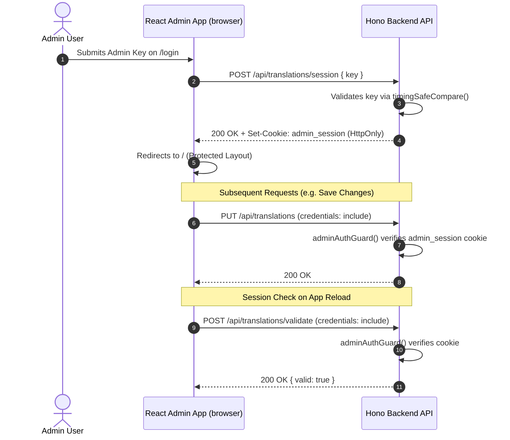

# Admin Authentication & Session Management Architecture

This document describes the security architecture and session lifecycle for the Sonora Admin Portal (`apps/admin`) and API (`apps/api`).

---

## 1. Overview & Security Goals

- **Remediation for CodeQL Alert #3 (`js/clear-text-storage-of-sensitive-data`)**: Prevent storage of administrative keys, tokens, or credentials in client-side JavaScript memory, `localStorage`, or `AsyncStorage`.
- **XSS Immunity**: Session tokens are issued exclusively via `HttpOnly` cookies. JavaScript in the browser cannot read or extract session tokens.
- **CSRF & CORS Protection**: Cross-site requests require `credentials: 'include'`, valid CORS preflight, and environment-calibrated `SameSite` cookie policies.

---

## 2. Authentication Lifecycle



---

## 3. Environment & Cookie Configuration

Session cookies are configured via Wrangler environment bindings with secure defaults:

| Variable                        | Local Dev (`apps/api/.env`) | Staging (`wrangler.staging.toml`) | Production (`wrangler.toml`) |
| ------------------------------- | --------------------------- | --------------------------------- | ---------------------------- |
| `ADMIN_SESSION_COOKIE_SAMESITE` | `Lax` (Cross-port dev)      | `Strict`                          | `Strict`                     |
| `ADMIN_SESSION_COOKIE_SECURE`   | `false` (HTTP)              | `true` (HTTPS)                    | `true` (HTTPS)               |
| Cookie Max-Age                  | 28,800s (8 hours)           | 28,800s (8 hours)                 | 28,800s (8 hours)            |

### Code Implementation (`apps/api/src/routes/translations.ts`)

```ts
const sameSite = c.env?.ADMIN_SESSION_COOKIE_SAMESITE || 'Strict';
const secure = c.env?.ADMIN_SESSION_COOKIE_SECURE !== 'false';

setCookie(c, 'admin_session', adminKey, {
  httpOnly: true,
  secure,
  sameSite,
  path: '/api',
  maxAge: 28800,
});
```

---

## 4. Frontend Integration (`apps/admin`)

- **`AuthContext` (`src/context/auth-context.tsx`)**: Global React Context managing `isAuthenticated` state.
- **Session Validation**: On mount, calls `AdminApiClient.checkSession()`, hitting `POST /api/translations/validate`. If the session is invalid or expired, `useAuth()` resets state and routes to `/login`.
- **CORS Handling**: `BaseApiClient` communicates with `credentials: 'include'` for all requests.

---

## 5. Verification & Testing

- **Static Analysis**: `make check-static` (0 lint/typecheck errors).
- **Unit Tests**: 100% function & line coverage across `adminAuthGuard`, `BaseApiClient`, `AdminApiClient`, `AuthContext`, and `configureCors`.
