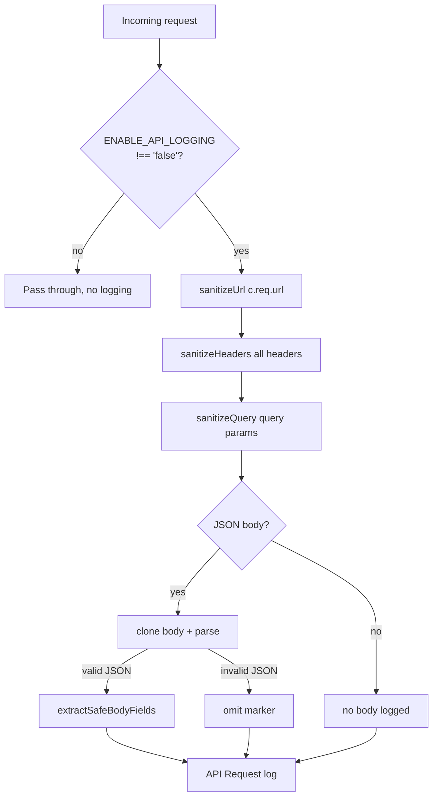
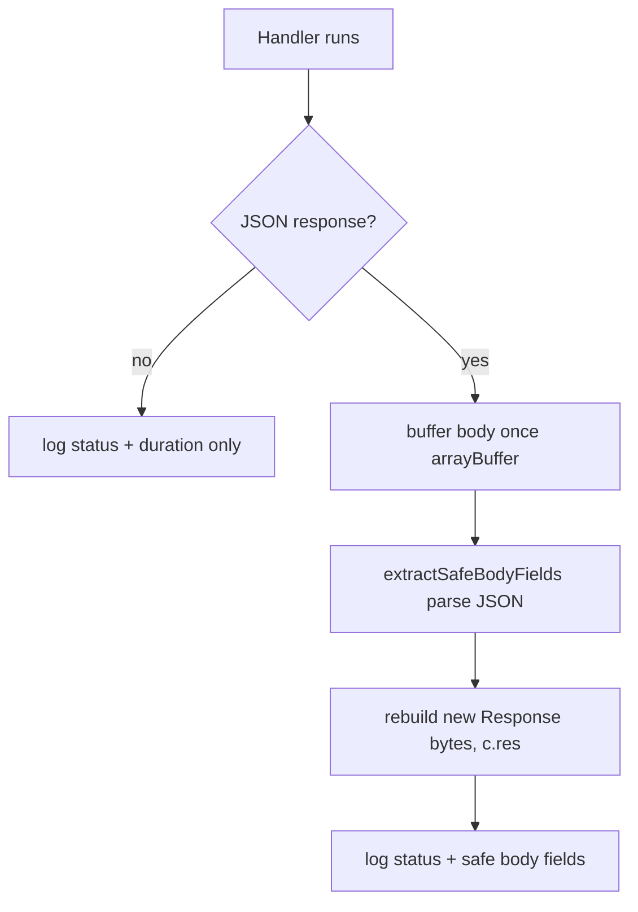

# API Logging Redaction (Sonora)

This document describes how Sonora's Hono API worker sanitizes request and response logging so that sensitive data — auth tokens, session cookies, buyer PII, device identifiers, and signed URLs — is never persisted to Cloudflare Workers Logs.

The policy is implemented once and shared across all logging surfaces. It applies to **every request and response** that passes through the API middleware, plus the outbound HTTP logging surfaces.

---

## 1. Problem

Before this policy, the API logged:

- **Full request URL including the query string** — `deviceId`, signed audio URLs, `email`, `data.id`.
- **All request headers** — `Authorization`, `Cookie`, `X-Api-Key`, `X-Device-Id`, `X-Request-Id`.
- **Full parsed JSON request bodies** — buyer PII, JWTs, device identifiers.
- **Full JSON/text response bodies** — signed audio URLs, Mercado Pago checkout URLs, tokens.
- **Redirect and webhook metadata** in payment routes — redirect URLs and complete purchase metadata objects.

Cloudflare Workers Logs retain data for 7 days and are readable by anyone with account access, so this was a real exposure.

## 2. Single source of truth

All redaction rules live in one helper:

```text
apps/api/src/lib/log-redaction.ts
```

No call site may implement ad-hoc redaction outside this helper. The helper exports five primitives:

| Function                      | Behavior                                                                                                                                                                                                                  |
| ----------------------------- | ------------------------------------------------------------------------------------------------------------------------------------------------------------------------------------------------------------------------- |
| `sanitizeUrl(url)`            | Removes the query string and hash. Absolute URLs → `origin + path`; custom schemes (`sonora://`) → `scheme + host + path`; relative paths → path only. Unparseable input reduces to `<unparseable>`, never the raw input. |
| `sanitizeHeaders(headers)`    | Returns only the allowlisted headers, matched case-insensitively.                                                                                                                                                         |
| `sanitizeQuery(query)`        | Returns only the allowlisted query params.                                                                                                                                                                                |
| `extractSafeBodyFields(body)` | Returns only explicitly allowlisted **top-level** fields; nested fields are never extracted.                                                                                                                              |

### Allowlists

| Allowlist                   | Allowed values                                                                                         |
| --------------------------- | ------------------------------------------------------------------------------------------------------ |
| Header                      | `content-type`, `user-agent`, `x-request-id`                                                           |
| Query param                 | `page`, `limit`, `sync`                                                                                |
| Body field (top-level only) | `purchaseId`, `status`, `event`, `providerPaymentId`, `merchant_order_id`, `externalReference`, `type` |

Anything not on an allowlist is omitted from the log, whether or not it appears in the real request/response.

## 3. Flow — request side

The `customLogger` middleware (`apps/api/src/middleware/logger.ts`) is mounted with `app.use(...)` and therefore wraps every request.



1. The middleware checks `c.env?.ENABLE_API_LOGGING !== 'false'`. When disabled, it passes through with **zero buffering and zero logging**.
2. It builds a metadata object with:
   - `headers` from `sanitizeHeaders`
   - `query` from `sanitizeQuery`
   - `body` (only for JSON content-type) from `extractSafeBodyFields`
3. The request body is read from a **clone** (`c.req.raw.clone()`), so the handler's stream is untouched.
4. Malformed JSON is logged as a non-sensitive omit marker, never the raw text.
5. It emits `[API Request] ${method} ${sanitizedUrl}`.

## 4. Flow — response side

After the handler runs, the middleware buffers and rebuilds the response to extract safe body fields while preserving the exact bytes for the real client.



1. The response is buffered once via `c.res.arrayBuffer()`.
2. Safe top-level fields are extracted with `extractSafeBodyFields`.
3. The response is rebuilt with `c.res = new Response(bodyBytes, c.res)` — status and headers are copied, and the body is **byte-identical** for the real network client.
4. It emits `[API Response] ${method} ${sanitizedUrl} - ${status} (${duration}ms)`.

Non-JSON responses (text, HTML, raw) are never buffered and log only status and duration.

## 5. Query strings

Query strings can carry tokens and codes, so they are handled twice:

- The **URL** in both the request and response log messages is always passed through `sanitizeUrl`, which strips the query.
- The query params in the metadata are filtered by `sanitizeQuery` to the `{page, limit, sync}` allowlist.

Tokens, `data.id`, signed URLs, and `deviceId` never appear in any query log.

## 6. Payment routes and webhook metadata

The payment routes (`apps/api/src/routes/payments.ts`) use the same helper at their call sites:

- **Redirect URLs** (`receivedRedirectUrl`, `rawRedirectUrl`, `finalTargetUrl`) are logged with `sanitizeUrl` — origin + path only, never the query.
- **Webhook metadata** is logged as **presence flags** (`existingMetadataPresent`, `incomingMetadataPresent`, `mergedMetadataCount`) instead of the complete objects, so buyer PII, redirect URLs, and device identifiers embedded in metadata are never persisted.
- The raw `Referer` header is never logged; only its parsed origin is.
- Error arguments are logged **name-only** on all client-reachable paths. Raw error objects are kept only on two internal DB/SDK paths with no client input reachability.

## 7. Outbound HTTP logging (HttpClient)

`apps/api/src/lib/http-client.ts` applies the same policy to outbound logs: request logs use `sanitizeUrl` + `sanitizeHeaders`, bodies are never logged, and response logs contain only `{ status }`. The network behavior itself is unchanged — redaction affects only what is written to the log.

> Note: as of this change, `HttpClient` has no production call sites (Mercado Pago traffic goes through the official SDK). The change there is policy consistency, not a live leak.

## 8. Toggle

`ENABLE_API_LOGGING` remains the on/off switch with unchanged semantics:

- `ENABLE_API_LOGGING !== 'false'` → logging enabled (default, since the secret is usually unset).
- Set to `'false'` → the middleware returns before any buffering or logging, so there is zero overhead.

**Redaction itself is unconditional.** No environment flag or setting can bypass it; when logging is on, it is always sanitized.

## 9. Invariant

The defining property, enforced by tests across every surface:

> **Sensitive data — auth headers, cookies, buyer PII, device identifiers, signed URLs, query strings, and full bodies — never appears in logged output.**

Negative tests assert these values are absent from the serialized log output (`apps/api/src/lib/__tests__/log-redaction.test.ts`, `apps/api/src/middleware/__tests__/logger.test.ts`, `apps/api/src/__tests__/http-client.test.ts`, `apps/api/src/__tests__/payments-redaction.test.ts`).
