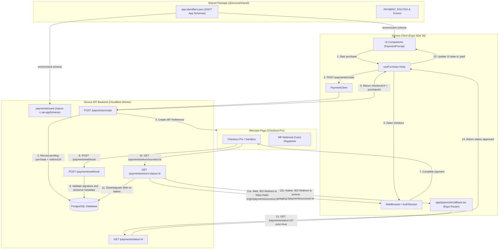
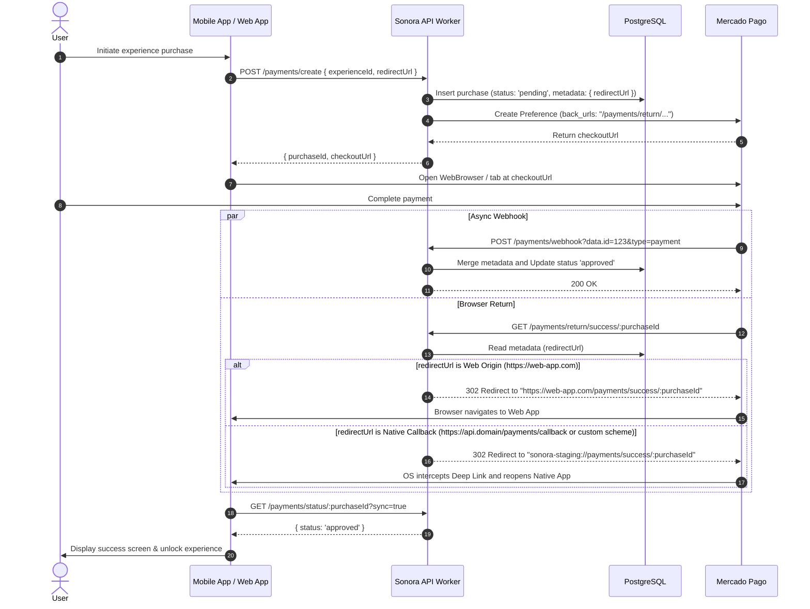

# Complete Payment Flow Architecture (Sonora)

This document describes the architecture, sequence flows, and endpoint specifications for Sonora's payment integration across all platforms (**Android Native**, **iOS Native**, and **Web**). It details the interactions between the **Mobile/Web App**, **Hono API Worker**, **Mercado Pago (Checkout Pro)**, and **Webhooks**.

---

## 1. High-Level Architecture Overview



---

## 2. Centralized App Schemes (Single Source of Truth)

To prevent scheme mismatches between the Expo mobile app and the Hono API backend, application schemes are centralized in `@sonora/shared`:

### `packages/shared/src/app-identifiers.json` (SSOT)

- **Staging**: `"scheme": "sonora-staging"`
- **Production**: `"scheme": "sonora"`

### `appScheme` Resolution in API

The [`paymentsGuard`](file:///var/home/masch/dev/js/sonora/apps/api/src/middleware/payments-guard.ts) middleware resolves the target OS scheme based on the active `ENVIRONMENT`:

```ts
const SCHEME_BY_ENVIRONMENT: Record<string, string> = {
  staging: APP_IDENTIFIERS.staging.scheme,
  production: APP_IDENTIFIERS.production.scheme,
};
c.set('appScheme', SCHEME_BY_ENVIRONMENT[env] || APP_IDENTIFIERS.production.scheme);
```

---

## 3. Standardized Routes & Endpoints (`PAYMENT_ROUTES`)

All payment-domain routes are defined in [`packages/shared/src/enums.ts`](file:///var/home/masch/dev/js/sonora/packages/shared/src/enums.ts):

| Component       | Route / Endpoint                           | Description                                              |
| :-------------- | :----------------------------------------- | :------------------------------------------------------- |
| **API Backend** | `POST /payments/create`                    | Initiates purchase session and creates MP preference     |
| **API Backend** | `POST /payments/webhook`                   | Receives async payment event notifications from MP       |
| **API Backend** | `GET /payments/return/:status/:purchaseId` | Browser return receiver from Mercado Pago (`back_urls`)  |
| **API Backend** | `GET /payments/status/:purchaseId`         | Purchase status check with active polling (`?sync=true`) |
| **API Backend** | `GET /payments/callback`                   | Native deep link fallback redirect                       |
| **API Backend** | `GET /payments/experiences/:id/purchased`  | Direct purchase check for a specific experience          |
| **API Backend** | `POST /payments/experiences/:id/access`    | Logs experience access (free / paid / restored)          |
| **App Client**  | `src/app/payments/callback.tsx`            | Expo Router native deep link callback receiver           |
| **App Client**  | `src/app/payments/success/[id].tsx`        | Expo Router success screen                               |
| **App Client**  | `src/app/payments/failure/[id].tsx`        | Expo Router failure screen                               |
| **App Client**  | `src/app/payments/pending/[id].tsx`        | Expo Router pending screen                               |

---

## 4. Return Redirection Logic (`/payments/return/:status/:purchaseId`)

Upon completing checkout, Mercado Pago redirects the browser to the API worker return endpoint. The endpoint differentiates Web clients from Native App clients:

### Redirection Algorithm ([`apps/api/src/routes/payments.ts`](file:///var/home/masch/dev/js/sonora/apps/api/src/routes/payments.ts#L284-L330))

1. **Read Metadata**: Retrieves `purchase.metadata.redirectUrl` saved during checkout creation.
2. **Origin Disambiguation**:
   - **Web App (`http://` or `https://` origin that is not a native API callback)**:
     Formats the return URL using the Web App origin:
     `https://<web-origin>/payments/:status/:purchaseId`
   - **Native App (`/payments/callback` URL or custom scheme `sonora-staging://`)**:
     Formats the native deep link using the active environment scheme:
     `${appScheme}://payments/:status/:purchaseId`
3. **URL Parsing Failures**: If `new URL(targetUrl)` throws due to a malformed URL, the API logs `logger.error(...)` and sets `targetUrl = ''`.
4. **Fallback Hierarchy**:
   - If `targetUrl` is falsy/empty, checks the `Referer` header. If it does not belong to a payment gateway (`mercadopago` / `mercadolibre`), redirects to the Referer origin.
   - If the Referer originated from Mercado Pago or is missing, redirects to the default native callback `${baseUrl}/payments/callback` (`sonora-staging://payments/callback`).

---

## 5. Webhooks & Metadata Preservation (Merge)

### `redirectUrl` Preservation ([`apps/api/src/routes/payments.ts`](file:///var/home/masch/dev/js/sonora/apps/api/src/routes/payments.ts#L239))

When Mercado Pago notifies status updates via `POST /payments/webhook`:

- The API merges existing purchase metadata (`existingMeta`) with incoming notification metadata (`incomingMeta`):
  ```ts
  const mergedMetadata = { ...existingMeta, ...incomingMeta };
  ```
- This ensures `redirectUrl` set during checkout creation is **never overwritten with `NULL`** when webhooks arrive before the browser return redirect completes.

### Idempotency & Replay Protection

- **HMAC-SHA256**: Validates `x-signature` header (with controlled logging bypass in staging).
- **State Transition Guard**: Prevents invalid status transitions (e.g. `refunded` -> `approved`).
- **Duplicate Detection**: Repeated notifications with matching status return `200 OK` immediately.

---

## 6. Complete Sequence Diagram (Web vs Native)



---

## 7. Quality Assurance & Testing

The payment architecture is fully covered by automated unit tests verified in CI and signed with GPG:

- **`packages/shared/src/__tests__/enums.test.ts`**: 100% coverage on route generators and domain enums.
- **`apps/api/src/__tests__/payments.test.ts`**: Covers checkout creation, idempotent webhooks, Web vs Native redirection, metadata preservation, and error handling.
- **Security Validation**: All commits GPG signed (`Good signature`) with strict pre-commit validation hooks (`format-check`, `test-ci`, `lint`, `typecheck`, `doctor-ci`, `gga`).
