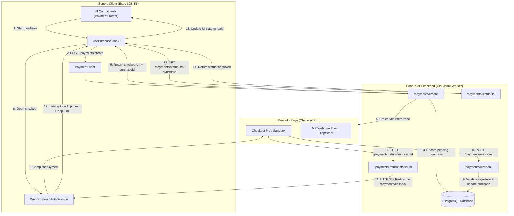
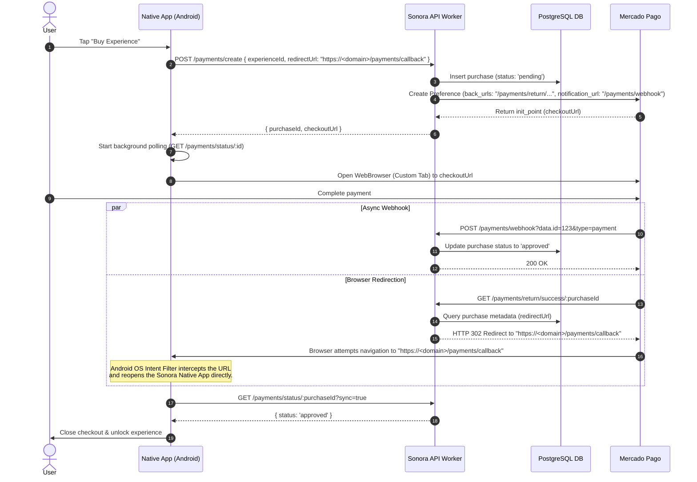
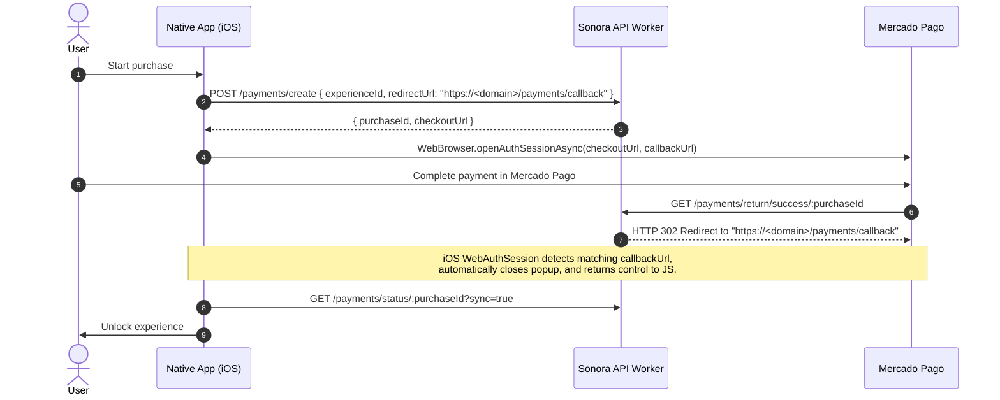
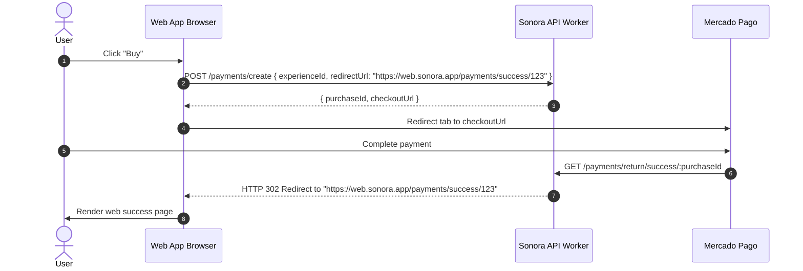

# Complete Payment Flow Architecture (Sonora)

This document describes the architecture, sequence flows, and endpoint specifications for Sonora's payment integration across all platforms (**Android Native**, **iOS Native**, and **Web**). It details the interactions between the **Mobile/Web App**, **Hono API Worker**, **Mercado Pago (Checkout Pro)**, and **Webhooks**.

---

## 1. High-Level Architecture Overview

---

## 2. Route & Endpoint Standardizations (Plural `/payments/`)

| Layer              | Route / URL                                | Description                                       |
| :----------------- | :----------------------------------------- | :------------------------------------------------ |
| **API Backend**    | `POST /payments/create`                    | Initializes checkout & creates MP preference      |
| **API Backend**    | `POST /payments/webhook`                   | Receives async provider webhook notifications     |
| **API Backend**    | `GET /payments/return/:status/:purchaseId` | Mercado Pago browser return handler (`back_urls`) |
| **API Backend**    | `GET /payments/status/:purchaseId`         | Client status polling endpoint (`?sync=true`)     |
| **App Client**     | `src/app/payments/success/[id].tsx`        | Expo Router success screen                        |
| **App Client**     | `src/app/payments/failure/[id].tsx`        | Expo Router failure screen                        |
| **App Client**     | `src/app/payments/pending/[id].tsx`        | Expo Router pending screen                        |
| **Universal Link** | `https://<domain>/payments/callback`       | Callback URL supplied in `redirectUrl`            |

---

## 3. Platform Sequence Diagrams

### A. Android Native (App Link Integration)

In Android Native, [`app.config.ts`](file:///var/home/masch/dev/js/sonora/apps/mobile/app.config.ts#L57-L70) configures an `intentFilter` listening to URLs with `pathPrefix: "/payments"`.

---

### B. iOS Native (Universal Links Integration)

In iOS Native, [`app.config.ts`](file:///var/home/masch/dev/js/sonora/apps/mobile/app.config.ts#L41) defines `associatedDomains: ["applinks:<domain>"]`.

---

### C. Web Frontend (Desktop / Mobile Browser)

---

## 4. Referer Filtering & Redirect Loop Prevention

### Gateway Domain Filtering

In [`apps/api/src/routes/payments.ts`](file:///var/home/masch/dev/js/sonora/apps/api/src/routes/payments.ts):

1. **Priority 1**: If `purchase.metadata.redirectUrl` exists, issue an HTTP 302 redirect.
2. **Priority 2**: Inspect `Referer` header. If domain belongs to a payment gateway (`mercadopago.com`, `mercadopago.com.ar`, `mercadolibre.com`), **ignore the referer**.
3. **HTML Fallback**: If no valid redirect URL or non-gateway referer exists, render an HTML confirmation page (`200 OK`) instructing the user that payment was completed and they can return to the app.

---

## 5. Webhook Validation & Polling Resilience

1. **HMAC-SHA256 Signature Verification**: Evaluates `x-signature` header using `MP_WEBHOOK_SECRET`.
2. **Idempotency & Replay Attack Prevention**: Enforces valid state machine transitions (e.g., blocks `refunded` -> `approved`).
3. **Active Fallback Polling (`?sync=true`)**: Forces real-time gateway checks if webhooks experience network latency.
