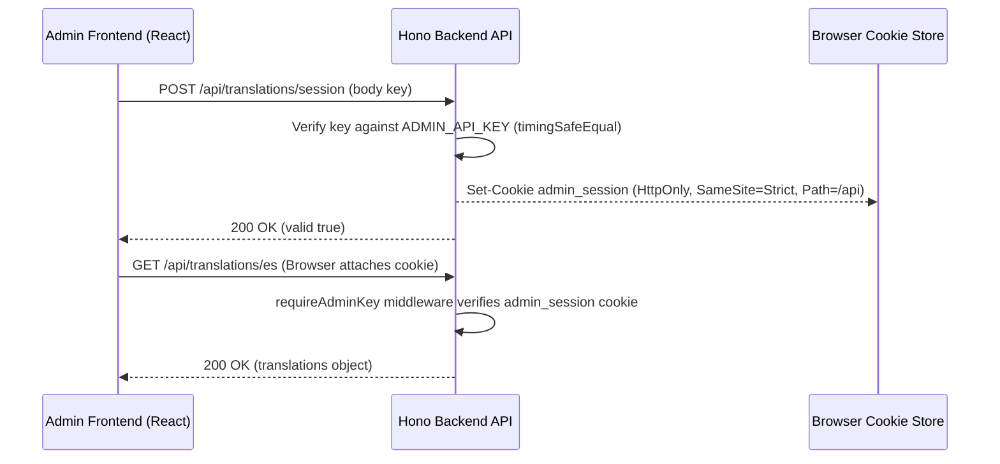

# Design: HttpOnly Cookie Authentication for Admin API

## Problem Analysis

Holding the admin key in client-side memory (`inMemoryAuthKey`) triggered CodeQL `js/clear-text-storage-of-sensitive-data` and exposed credentials to potential XSS extraction.

## Architecture & Data Flow

## Detailed Component Changes

### 1. `apps/api`

- **Cookies middleware / helper:** Use Hono's `hono/cookie` (`getCookie`, `setCookie`, `deleteCookie`).
- **Session verification:** Store a signed session token or validate the cookie value against a hashed `ADMIN_API_KEY` token using timing-safe comparison.
- **Middleware `requireAdminKey`:** Check for valid `admin_session` cookie first; fallback to `Authorization: Bearer <key>` if provided for programmatic CLI access.

### 2. `apps/admin`

- **`AdminApiClient`:** Remove `inMemoryAuthKey`, `setAuthKey`, `getAuthKey`, `clearAuthKey`.
- **Fetch options:** Ensure `credentials: 'include'` is set on all fetch requests.
- **Login / Logout:** `login(key)` calls `POST /api/admin/session`; `logout()` calls `DELETE /api/admin/session`.
