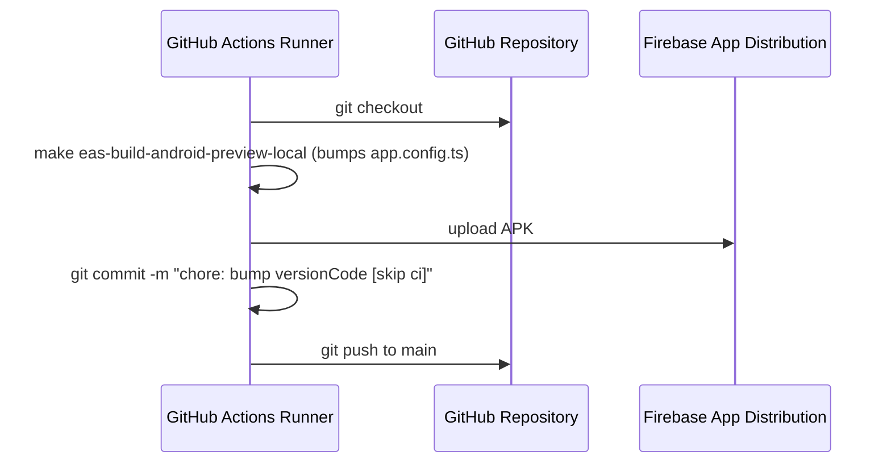

# Design: Android CI versionCode Auto-increment

We will update the `deploy.yml` workflow to grant write permissions and add steps that commit the version code change.

## Workflow Integration Design

1. **Job-Level Permissions**:
   Add `permissions: contents: write` to the `deploy` job in `.github/workflows/deploy.yml` so that the `GITHUB_TOKEN` has write access to the repository.

2. **Commit and Push Steps**:
   After the local build runs (which bumps `app.config.ts` locally via `make`), we will run a step to:
   - Configure Git using the standard GitHub Actions bot credentials.
   - Stage `app.config.ts`.
   - Commit with the message `chore: bump android versionCode [skip ci]` to prevent recursive triggering.
   - Push to `main`.

## Alternatives Considered

- **Dynamic Calculation via Run Number**: Rejected by user preference in favor of maintaining the version code source of truth in `app.config.ts`.
