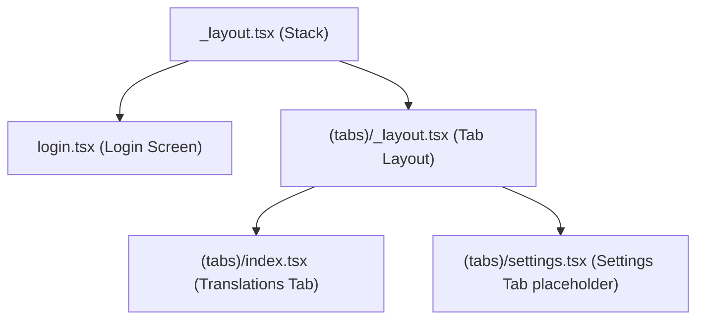

# Proposal: Web Admin Tabs Refactor

We propose restructuring the `@sonora/admin` web application to introduce a tab-based navigation group `(tabs)`. This will align the routing structure with the mobile app and make it easy to scale the admin panel with new screens in the future.

## User Review Required

> [!IMPORTANT]
> The admin web panel is primarily accessed via desktop/browsers. We propose using a web-friendly header-based tab navigation system rather than a mobile-like bottom tab bar. The tabs will be displayed at the top or side of the dashboard, fitting the existing admin style.

---

## Proposed Changes

We will restructure the routes in `apps/admin/src/app` as follows:

### Route Layout Restructure

### Components

#### [NEW] [admin-tabs.tsx](file:///home/masch/dev/js/sonora/apps/admin/src/components/admin-tabs.tsx)

A new web-friendly tab navigator component for the admin panel that renders a clean header navigation bar and routes between active tabs.

---

## Verification Plan

### Automated Tests

We will verify that:

- The redirect rules in the root layout redirect unauthenticated users to `/login`.
- The new `(tabs)` layout and index screen render correctly.
- All ESLint checks, TypeScript checks, and existing tests pass.

Commands to run:

- `bun run typecheck` inside `apps/admin`
- `bun run lint` inside `apps/admin`
- `bun run test` inside `apps/admin`
