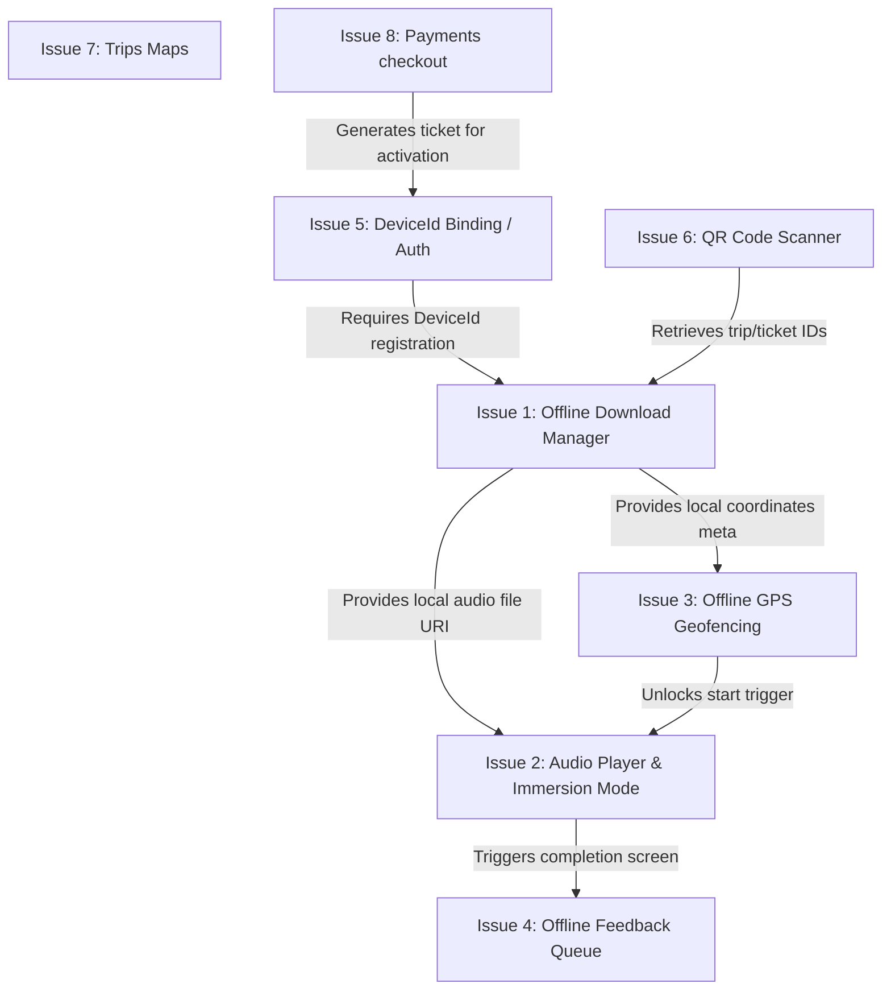

# Proposal: Sonora MVP Core Architecture

This proposal defines the foundational architecture and features to be implemented for the Sonora MVP. The primary focus is providing a robust offline-first audio-guided walking experience in nature (Umepay).

## User Review Required

> [!IMPORTANT]
>
> - **iOS via Web (Nice-to-Have Fallback):** Due to strict browser background execution limits on iOS (Safari), the web fallback might experience playback pauses if the user locks the screen. Android native remains the primary target for full offline robustness.
> - **Device-Bound Tickets:** Tickets will be permanently locked to a generated `DeviceId` on the first activation.

---

## Critical Path and Dependencies (Roadmap)

To optimize development speed and address the highest technical risks first, we must build functionalities following this dependency hierarchy.

### Dependency Analysis:

1. **Device ID & Ticket Binding (Issue 5)** is the gatekeeper. We cannot securely trigger downloads (Issue 1) without resolving how the app registers its identifier on first contact.
2. **Download Manager (Issue 1)** is the prerequisite for the core experience. Both the **Audio Player (Issue 2)** (requires local audio file URI) and the **GPS Geofencer (Issue 3)** (requires local starting coordinates metadata) depend on it to run 100% offline.
3. **QR Scanner (Issue 6)** and **Payments (Issue 8)** feed the download manager and auth binding with Ticket IDs and redirections.
4. **Feedback Queue (Issue 4)** relies on the player completing its track to present the submission view.

---

## Proposed Changes

We are introducing the roadmap and defining the specifications for Phase 1 of the MVP.

### [NEW] [mvp_prioritization_plan.md](../prioritization/mvp_prioritization_plan.md)

Contains the prioritized phases of the MVP development.

### [NEW] [github_issues.md](../prioritization/github_issues.md)

Contains the 9 mapped GitHub issues.

---

## Verification Plan

### Automated Tests

- Ensure clean build of Android dev client.
- Offline download state unit tests.

### Manual Verification

- Simulate offline mode on Chrome/Safari and verify Audio Cache capability via Service Worker.
- Verify GPS coordinate proximity validation on Android.
