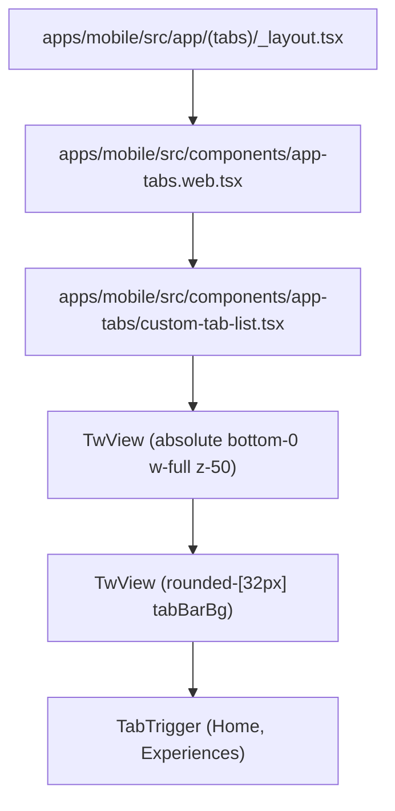

# Design Document: Mobile Web Bottom Navigation Tabs

## Architecture & Layout

## Component Changes

### CustomTabList (`apps/mobile/src/components/app-tabs/custom-tab-list.tsx`)

- Extended `TabListProps` interface to accept optional `testID?: string`.
- Set default parameter `testID = 'custom-tab-list'`.
- Added Tailwind classes `bottom-0` and `z-50` to absolute positioning container.

### App Layout (`apps/mobile/src/app/(tabs)/index.tsx`)

- Removed `AppVersionText` import and JSX element from home screen layout.
