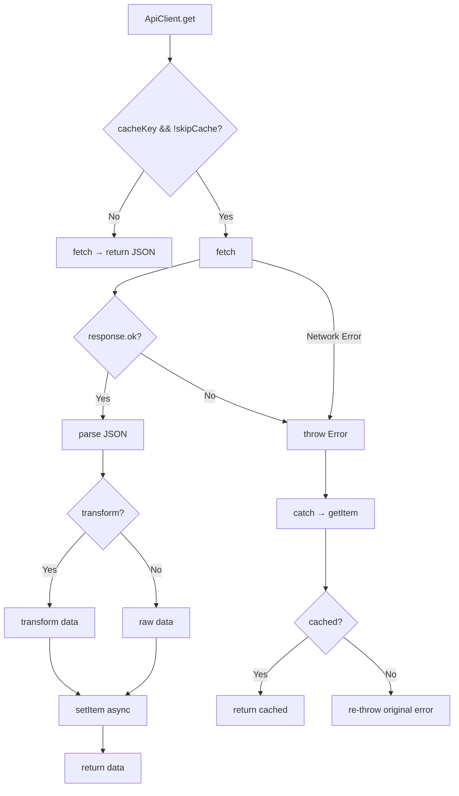

# Design: API Client Refactor — Unified Offline Fallback

This design document describes the technical architecture of the centralized `ApiClient` service and the migration of existing consumers.

---

## 1. File Structure

```
apps/mobile/src/
├── services/
│   ├── api-client.ts                          # Centralized HTTP client
│   └── __tests__/
│       └── api-client.test.ts                 # Unit tests (100% coverage)
├── config/
│   └── app-config.ts                          # APP_CONFIG.apiBaseUrl
├── storage/
│   └── feedback-storage.ts                    # getItem/setItem (expo-sqlite/kv-store)
├── data/
│   └── experiences.ts                         # [MODIFIED] Uses ApiClient.get
├── hooks/
│   ├── use-feedback-feed.ts                   # [MODIFIED] Uses ApiClient.get
│   └── use-feedback-sync.ts                   # [MODIFIED] Uses ApiClient.post
├── components/
│   ├── trip-detail-view.tsx                   # [MODIFIED] Uses ApiClient.post
│   └── track-detail-view.tsx                  # [MODIFIED] Uses ApiClient.post
└── app/(tabs)/
    └── messages.tsx                           # [MODIFIED] Uses ApiClient.post
```

---

## 2. ApiClient Interface

```typescript
interface RequestOptions extends Omit<RequestInit, 'body'> {
  cacheKey?: string;       // KV-store key for GET cache
  skipCache?: boolean;     // Bypass cache read/write
  body?: unknown;          // Auto-serialized to JSON
  transform?: (data: any) => any;  // Map raw response before cache & return
  customErrorMessage?: string;     // Override default error message
}

const ApiClient = {
  request<T>(path: string, options?: RequestOptions): Promise<T>;
  get<T>(path: string, options?: Omit<RequestOptions, 'method' | 'body'>): Promise<T>;
  post<T>(path: string, body: unknown, options?: Omit<RequestOptions, 'method' | 'body'>): Promise<T>;
};
```

---

## 3. Cache Flow (GET with cacheKey)



---

## 4. Migration Pattern

Each consumer was migrated from:

```typescript
// BEFORE — duplicated in every file
try {
  const response = await fetch(`${APP_CONFIG.apiBaseUrl}/endpoint`);
  if (!response.ok) throw new Error('...');
  const data = await response.json();
  await setItem('cache-key', JSON.stringify(data));
  return data;
} catch {
  const cached = await getItem('cache-key');
  if (cached) return JSON.parse(cached);
  throw error;
}
```

To:

```typescript
// AFTER — one line
const data = await ApiClient.get('/endpoint', { cacheKey: 'cache-key' });
```

### Consumer Changes

| File                    | Method                            | Change                                          |
| ----------------------- | --------------------------------- | ----------------------------------------------- |
| `experiences.ts`        | `fetchThemes`, `fetchExperiences` | `ApiClient.get` with `cacheKey` and `transform` |
| `use-feedback-feed.ts`  | `fetchFeedData`                   | `ApiClient.get` with `cacheKey`                 |
| `use-feedback-sync.ts`  | `flushQueue`                      | `ApiClient.post`                                |
| `messages.tsx`          | submit handler                    | `ApiClient.post`                                |
| `trip-detail-view.tsx`  | submit handler                    | `ApiClient.post`                                |
| `track-detail-view.tsx` | submit handler                    | `ApiClient.post`                                |

---

## 5. Design Decisions

1. **Object-literal, not class**: `ApiClient` is a plain object with methods to avoid `new` ceremony and allow tree-shaking.
2. **Cache writes are fire-and-forget**: `setItem` failures are caught and logged but never block the response to the consumer.
3. **`feedbackQueue` stays in UI**: The offline queue for feedback submission remains in the UI components — the `ApiClient` handles request-level concerns, not application-level queue management.
4. **`response.ok` fallback**: The client checks `response.ok` first, but falls back to `status >= 200 && status < 300` for environments where `ok` may be undefined (React Native polyfills).
5. **No retry logic in ApiClient**: Retries are the responsibility of the consumer (e.g., `use-feedback-sync` retry loop). The client is a single-request abstraction.
